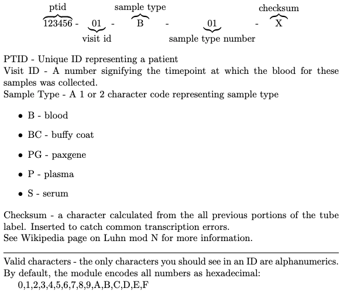

# REDCap Zebra Label Printer

REDCap Zebra Label Printer external module extends REDCap to print labels to Zebra printers using data from a REDCap record, a ZPL layout, and printing plan. The first version of REDCap Zebra Label Printer has the ZPL layout and print plan hard coded into the module. Future versions will provide more configurability.

## Prerequisites
 - REDCap >= 14.0.2
 - PHP >= 8
 - Zebra's Browser Print software
 - Zebra printer
 - Suitable labels for your Zebra printer. Only the DFP-103 label is supported at this time.

## Easy installation

The module is not yet in the VUMC's REDCap Repo. All installation must be done manually.

## Manual Installation
- Clone this repo into to `<redcap-root>/modules/redcap_zebra_label_printer_v0.0.0`.

## Introduction
The __REDCap Zebra Label Printer__ external module prints a preprogrammed layout of 23 labels onto __DFP-103 Cryogenic Labels__. The layout is designed to facilitate blood draw and processing for sites within the 1Florida Alzheimer's Disease Research Center. It has multiple labels each for serum, plasma, paxgene, buffy coat, and blood. The module prints this layout on each label.

>  

The labels are printed in a long strip.

> 

The module adds a button under REDCap form field to allow printing of a 23-label set for that record and event. The `@TUBE-LABEL-GENERATOR` action tag positions the button under any field where it is used.

> 

__REDCap Zebra Label Printer__ interacts with Zebra's Browser Print software to send ZPL files to a pre-selected, locally-attached printer.

## Installation and setup

To use this module, get a Zebra printer and labels, then follow the steps here.

### REDCap setup

1. Install the module into your REDCap system by cloning this repo into to `<redcap-root>/modules/redcap_zebra_label_printer_vN.M.O`, where "N.M.O" is the version of the module you are installing.
2. Enable the module in the REDCap Control Center.
3. Enable the module in a REDCap project. If you need a sample project, there is one available in the [examples](./examples/) folder in the repo on [Github](https://github.com/ctsit/redcap_zebra_label_printer).
4. Add the `@TUBE-LABEL-GENERATOR` action tag to a field in your REDCap project. Note: this is already done in the example project.
5. Open the form that has the field of interest and verify you can see the _Generate Biospecimen Labels_ button.
6. Press the _?_ button to the right of _Generate Biospecimen Labels_ button. You'll need this help in the steps below.

### Module Configuration

You will need to configure the module for your project. At a minimum you need to indicate which field has the Subject ID--typically, _record_id_--and which field has the "event field". The _event field_ is need on longitudinal projects to indicate at what event the specimen was collected.

- **Input Base**: The numeric base system of your input, default is 10
- **Output Base**: Default value is 16, but up to 36, note that you will need to use an even number for the [checksum algorithm to work](https://en.wikipedia.org/wiki/Luhn_mod_N_algorithm#Limitation)
- **Subject ID field**: The field that contains the record identifier.
- **Visit number field**: The field that contains the visit number.

### Printer setup

1. Attach the Zebra printer to a computer with access to REDCap.
2. Load labels into you Zebra printer.
3. Follow the __Quick Start Guide__ provided with your Zebra printer to complete the setup. Ensure you finish all steps up to __Step 9__, which includes __Smart Calibration__.
4. Download and install the Zebra [Browser Print app](https://www.zebra.com/gb/en/support-downloads/software/printer-software/browser-print.html#browser-print).
5. Follow the steps described in the module help button mentioned above under _REDCap Setup_

## Using the module

Access the form where the _Generate Biospecimen Labels_ button is displayed. The field will be grayed out if the visit number field is missing or blank. Key in the visit number then press the "Generate biospecimen labels" button. This will open a print dialog. Acknowledge it and printing should start immediately. If instead you get an error, note the error, attempt to address and retry printing. If that does not rectify the error, access the module's setup and debugging help via the "?" button next to the _Generate Biospecimen Labels_ button.

> 

## Notes

The software was developed and tested with the Zebra ZD611, but any Zebra printer should work if it is appropriate for the labels you have chosen.

The barcode string, e.g. `110001-03-S-1` has the following components
> 
